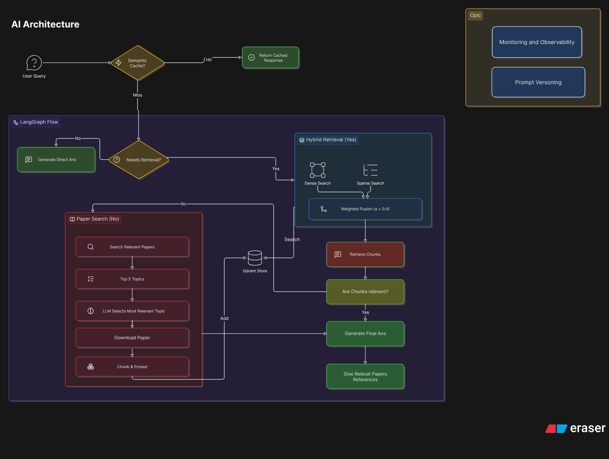

# The AI Architecture: Under the Hood

Building a robust Research Paper RAG application isn't just about throwing text into an LLM. It requires a carefully orchestrated flow of decisions, caching, retrieval, and fallback mechanisms. 

To manage this complex state machine, I utilized **LangGraph**, which allows us to define the AI agent's workflow as a directed graph. 

### Architecture Diagram

```mermaid
graph TD
    User([User Query]) --> Cache{Semantic Cache<br/>(Redis)}
    Cache -- Hit --> Return([Return Cached Response])
    Cache -- Miss --> Route{Needs Retrieval?}
    
    Route -- No --> Generate[Final Answer Generation]
    Route -- Yes --> Hybrid[(Local Hybrid Retrieval<br/>Qdrant: Dense + Sparse)]
    
    Hybrid --> Filter{Relevancy Filter}
    Filter -- Relevant --> Generate
    
    Filter -- Not Relevant --> Arxiv[ArXiv Web Search Fallback]
    Arxiv --> Top5[Fetch Top 5 Papers]
    Top5 --> Select[LLM Selects Best Paper]
    Select --> Embed[Download, Chunk, & Embed]
    Embed --> Store[(Store new chunks<br/>in Qdrant)]
    Store --> Generate
    
    Generate --> PopulateCache[(Populate Redis Cache)]
    PopulateCache --> Return
```

Here is a step-by-step breakdown of the AI Architecture from the moment a user submits a query:

### 1. The Entry Point & Semantic Caching
Before we do any heavy lifting, we start by checking our **Semantic Cache**. 
- The user's query is converted into an embedding using our dense embedding model (`mixedbread-ai/mxbai-embed-large-v1`).
- We perform a vector similarity search against a **Redis-backed Semantic Cache**.
- **Cache Hit**: If a previously asked query is highly similar (e.g., > 90% cosine similarity), we immediately return the cached response. This drastically reduces latency (returning answers in milliseconds) and saves LLM token costs.
- **Cache Miss**: If it's a novel query, it proceeds into the LangGraph workflow.

### 2. The Retrieval Router (Needs Retrieval?)
Once inside the graph, the first node acts as a lightweight router. An LLM evaluates the query to determine if it requires retrieving specific context (like answering a technical question about a paper) or if it's just a general conversational query (like "Hi").
- **No**: If no retrieval is needed, the query routes straight to the final generation node.
- **Yes**: If retrieval is needed, we proceed to our local Hybrid Retrieval system.

### 3. Local Hybrid Retrieval
For queries requiring context, we query our **Qdrant Vector Database**, which stores all previously processed research papers.
- We perform a **Hybrid Search**, executing both a Dense Search (semantic meaning) and a Sparse Search (BM25 keyword matching) simultaneously.
- We combine these results using **Weighted Fusion**. As established during our evaluation phase, we apply a weight of **0.4** to dense retrieval (and 0.6 to sparse), which yielded the highest MRR for our dataset.

### 4. Relevancy Filtering
Retrieving documents isn't enough; we need to ensure they actually answer the user's specific question. The retrieved chunks are passed through a strict **Relevancy Filter**. An LLM evaluates each chunk against the query. If the local chunks are relevant, we proceed directly to generating the answer.

### 5. The Fallback: ArXiv Web Search
What happens if the Qdrant database doesn't have the answer, or the user is asking about a brand new topic? We have a dynamic fallback mechanism!
- If no relevant local documents are found, the graph routes to an **ArXiv Web Search** node.
- The system queries ArXiv and pulls the metadata for the **Top 5** most related papers.
- An LLM analyzes the abstracts of these 5 papers and selects the **single most relevant paper** for the user's query.
- The system then downloads the full PDF of that paper, processes it, chunks it, and generates both dense and sparse embeddings on the fly!

### 6. Storing for the Future (Continuous Learning)
Once the new paper is processed, the system doesn't just answer the question and forget it. 
- The newly embedded document chunks are permanently **stored in the Qdrant Vector Database**. 
- This means the system continuously learns. The next time a user asks a related question, the system will instantly find it in Qdrant via Hybrid Retrieval without needing to search ArXiv again!

### 7. Final Generation & Cache Population
Finally, the most relevant chunks (either from local Qdrant or dynamically pulled from ArXiv) are passed to our primary Large Language Model.
- The LLM synthesizes the information and generates a comprehensive, highly accurate response for the user, complete with references.
- Before returning the response to the user, the original query, its embedding, and the final answer are saved into the **Redis Semantic Cache**.

By combining Semantic Caching, Hybrid Retrieval, Relevancy Filtering, and Dynamic Fallback, this architecture ensures maximum accuracy while optimizing for both speed and cost!\



